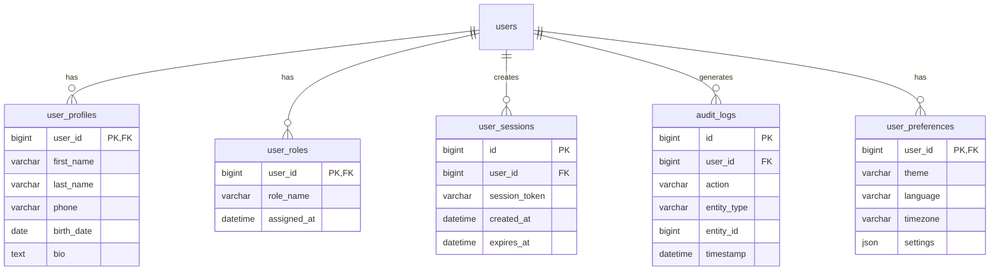

# User Management System - Entity Relationship Diagram (ERD)

## 📋 Overview

This document contains the Entity Relationship Diagram (ERD) for the User Management System database. The ERD is based on the Software Requirements Specification (SRS) and represents the current database schema, relationships, and constraints implemented in the system.

## 🗄️ Database Information

- **Database Name**: `mini_db`
- **Database Engine**: MySQL 8.0
- **ORM Framework**: Spring Data JPA with Hibernate
- **Character Set**: UTF-8MB4
- **Storage Engine**: InnoDB

---

## 📊 Entity Relationship Diagram

```mermaid
erDiagram
    users {
        bigint id PK "AUTO_INCREMENT"
        varchar username UK "NOT NULL"
        varchar email UK "NOT NULL"
        varchar password "NOT NULL"
        datetime created_at "NOT NULL"
    }

    %% Notes for entities
    note for users "User entity implementing Spring Security UserDetails interface"
    
    %% Table constraints and indexes
    note right of users : "Indexes:\n- idx_username (username)\n- idx_email (email)\n\nConstraints:\n- username UNIQUE\n- email UNIQUE\n- id PRIMARY KEY"
```

---

## 🏗️ Detailed Entity Descriptions

### 1. Users Table

**Table Name**: `users`

**Purpose**: Stores user account information and authentication credentials. Implements Spring Security's `UserDetails` interface for authentication purposes.

#### Columns

| Column Name | Data Type | Constraints | Description |
|-------------|-----------|-------------|-------------|
| `id` | `BIGINT` | PRIMARY KEY, AUTO_INCREMENT | Unique identifier for each user |
| `username` | `VARCHAR(255)` | NOT NULL, UNIQUE | User's unique login name |
| `email` | `VARCHAR(255)` | NOT NULL, UNIQUE | User's unique email address |
| `password` | `VARCHAR(255)` | NOT NULL | BCrypt-encoded password hash |
| `created_at` | `DATETIME` | NOT NULL | Timestamp when user account was created |

#### Indexes

| Index Name | Column | Type | Purpose |
|------------|--------|------|---------|
| `PRIMARY` | `id` | PRIMARY KEY | Fast primary key lookups |
| `idx_username` | `username` | UNIQUE | Fast username lookups and uniqueness |
| `idx_email` | `email` | UNIQUE | Fast email lookups and uniqueness |

#### Entity Relationships

```
users (Current Implementation)
├── No foreign key relationships (single entity system)
├── Self-contained authentication via Spring Security
└── Potential for future relationships:
    ├── user_profiles (1:1)
    ├── user_roles (1:N)
    ├── user_sessions (1:N)
    └── audit_logs (1:N)
```

---

## 🔐 Security Implementation

### Password Storage

- **Algorithm**: BCrypt
- **Strength Factor**: 10 (default)
- **Example Hash**: `$2a$10$slYQmyNdGzin7olVN3p5Be7DlH.PKZbv5H8KnzzVgXXbVxzy2QIDM`

### Spring Security Integration

The `User` entity implements Spring Security's `UserDetails` interface:

```java
public class User implements UserDetails {
    // Entity fields...
    
    @Override
    public Collection<? extends GrantedAuthority> getAuthorities() {
        return Collections.singletonList(new SimpleGrantedAuthority("USER"));
    }
    
    @Override
    public boolean isAccountNonExpired() { return true; }
    @Override
    public boolean isAccountNonLocked() { return true; }
    @Override
    public boolean isCredentialsNonExpired() { return true; }
    @Override
    public boolean isEnabled() { return true; }
}
```

---

## 📝 Database Schema (SQL)

### Auto-Generated Schema (JPA/Hibernate)

```sql
-- Generated by Spring Boot JPA/Hibernate
CREATE TABLE users (
    id BIGINT AUTO_INCREMENT PRIMARY KEY,
    username VARCHAR(255) NOT NULL UNIQUE,
    email VARCHAR(255) NOT NULL UNIQUE,
    password VARCHAR(255) NOT NULL,
    created_at DATETIME NOT NULL,
    INDEX idx_username (username),
    INDEX idx_email (email)
) ENGINE=InnoDB DEFAULT CHARSET=utf8mb4;
```

### Manual Schema (Reference)

```sql
-- Manual schema definition (if needed)
CREATE TABLE IF NOT EXISTS users (
    id BIGINT AUTO_INCREMENT PRIMARY KEY,
    username VARCHAR(255) NOT NULL UNIQUE,
    email VARCHAR(255) NOT NULL UNIQUE,
    password VARCHAR(255) NOT NULL,
    created_at DATETIME NOT NULL,
    INDEX idx_username (username),
    INDEX idx_email (email)
) ENGINE=InnoDB DEFAULT CHARSET=utf8mb4;
```

---

## 🔄 Data Operations

### CRUD Operations

| Operation | SQL Query | Purpose |
|-----------|-----------|---------|
| **Create** | `INSERT INTO users (username, email, password, created_at) VALUES (?, ?, ?, ?)` | Register new user |
| **Read (All)** | `SELECT * FROM users` | Get all users (admin) |
| **Read (One)** | `SELECT * FROM users WHERE id = ?` | Get user by ID |
| **Read (ByUsername)** | `SELECT * FROM users WHERE username = ?` | Authentication lookup |
| **Update** | `UPDATE users SET username = ?, email = ? WHERE id = ?` | Update user info |
| **Delete** | `DELETE FROM users WHERE id = ?` | Remove user account |

### Authentication Queries

```sql
-- Spring Security authentication query
SELECT username, password, enabled 
FROM users 
WHERE username = ?;

-- User authorities query
SELECT authority 
FROM authorities 
WHERE username = ?;
```

---

## 📈 Database Performance Considerations

### Indexing Strategy

- **Primary Index**: `id` (auto-increment, clustered)
- **Unique Indexes**: `username`, `email` (for fast authentication)
- **Composite Indexes**: Not currently needed (single entity)

### Query Optimization

- **Authentication**: Optimized via `username` index
- **User Lookup**: Optimized via `id` primary key
- **Email Operations**: Optimized via `email` unique index
- **Batch Operations**: Efficient via JPA batch processing

### Connection Pooling (HikariCP)

```properties
spring.datasource.hikari.connection-timeout=20000
spring.datasource.hikari.minimum-idle=5
spring.datasource.hikari.maximum-pool-size=12
spring.datasource.hikari.idle-timeout=300000
spring.datasource.hikari.max-lifetime=1200000
```

---

## 🔮 Future Database Extensions

### Potential Entity Relationships



### Recommended Extensions

1. **User Profiles** (1:1 relationship)
   - Personal information
   - Profile pictures
   - Social links

2. **Role-Based Access Control** (1:N relationship)
   - Multiple roles per user
   - Permission management
   - Admin/Editor/Viewer roles

3. **Session Management** (1:N relationship)
   - Active sessions tracking
   - Session invalidation
   - Multi-device support

4. **Audit Logging** (1:N relationship)
   - User activity tracking
   - Security event logging
   - Compliance requirements

5. **User Preferences** (1:1 relationship)
   - UI customization
   - Notification settings
   - Privacy preferences

---

## 🛠️ Database Maintenance

### Backup Strategy

```sql
-- Full database backup
mysqldump -u root -p mini_db > backup_mini_db_$(date +%Y%m%d_%H%M%S).sql

-- Users table backup
mysqldump -u root -p mini_db users > backup_users_$(date +%Y%m%d_%H%M%S).sql
```

### Data Migration

```sql
-- Export user data
SELECT id, username, email, created_at 
FROM users 
INTO OUTFILE '/tmp/users_export.csv' 
FIELDS TERMINATED BY ',' 
ENCLOSED BY '"' 
LINES TERMINATED BY '\n';

-- Import user data
LOAD DATA INFILE '/tmp/users_export.csv' 
INTO TABLE users 
FIELDS TERMINATED BY ',' 
ENCLOSED BY '"' 
LINES TERMINATED BY '\n'
(id, username, email, created_at);
```

### Performance Monitoring

```sql
-- Check table size
SELECT 
    table_name,
    ROUND(((data_length + index_length) / 1024 / 1024), 2) AS 'Size (MB)'
FROM information_schema.tables 
WHERE table_schema = 'mini_db';

-- Check index usage
SELECT 
    table_name,
    index_name,
    cardinality
FROM information_schema.statistics 
WHERE table_schema = 'mini_db' 
AND table_name = 'users';
```

---

## 📚 Related Documentation

- [Software Requirements Specification (SRS)](docs/SRS_Ruperez.pdf)
- [Architecture Diagrams](ARCHITECTURE_DIAGRAM.md)
- [Sequence Diagrams](SEQUENCE_DIAGRAMS.md)
- [Database Setup Guide](docs/USE_XAMPP.md)
- [API Documentation](README.md#-api-endpoints)

---

## 🔍 Technical Specifications

### Database Configuration

```properties
# MySQL Connection
spring.datasource.url=jdbc:mysql://localhost:3306/mini_db?useSSL=false&serverTimezone=UTC&allowPublicKeyRetrieval=true&useUnicode=true&characterEncoding=UTF-8
spring.datasource.username=root
spring.datasource.password=
spring.datasource.driver-class-name=com.mysql.cj.jdbc.Driver

# JPA/Hibernate Configuration
spring.jpa.hibernate.ddl-auto=update
spring.jpa.show-sql=true
spring.jpa.properties.hibernate.dialect=org.hibernate.dialect.MySQL8Dialect
spring.jpa.properties.hibernate.format_sql=true
```

### Entity Annotations

```java
@Entity
@Table(name = "users")
public class User implements UserDetails {
    
    @Id
    @GeneratedValue(strategy = GenerationType.IDENTITY)
    private Long id;
    
    @Column(nullable = false, unique = true)
    private String username;
    
    @Column(nullable = false, unique = true)
    private String email;
    
    @Column(nullable = false)
    private String password;
    
    @Column(name = "created_at", nullable = false)
    private LocalDateTime createdAt;
}
```

This ERD documentation provides a comprehensive view of the User Management System's database structure, relationships, and implementation details based on the SRS requirements and current system implementation.
