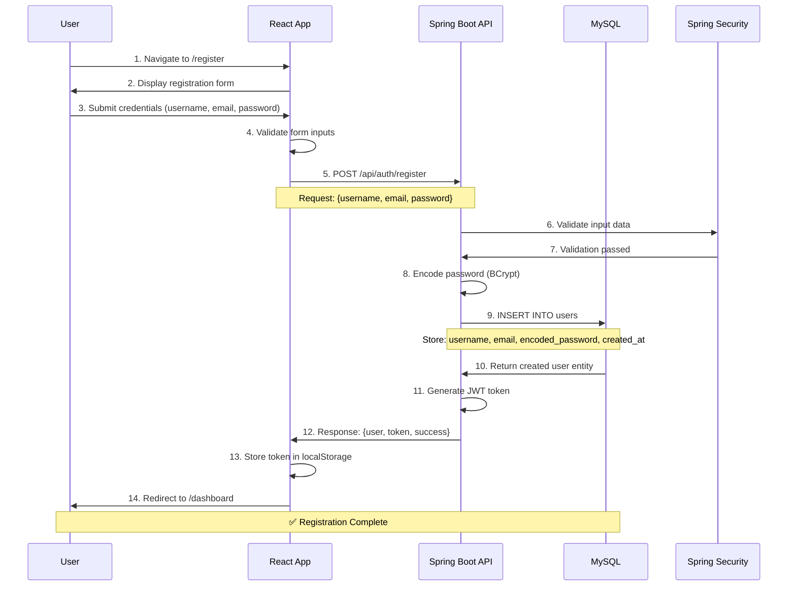
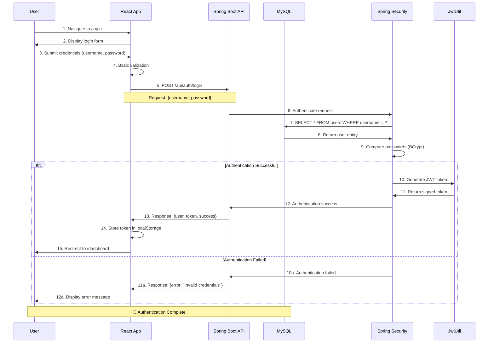
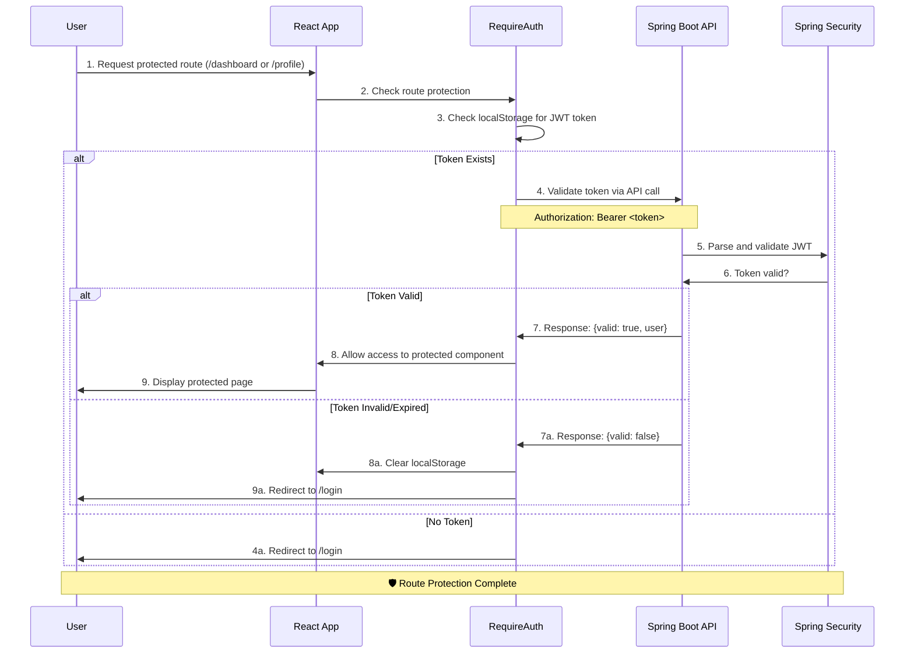
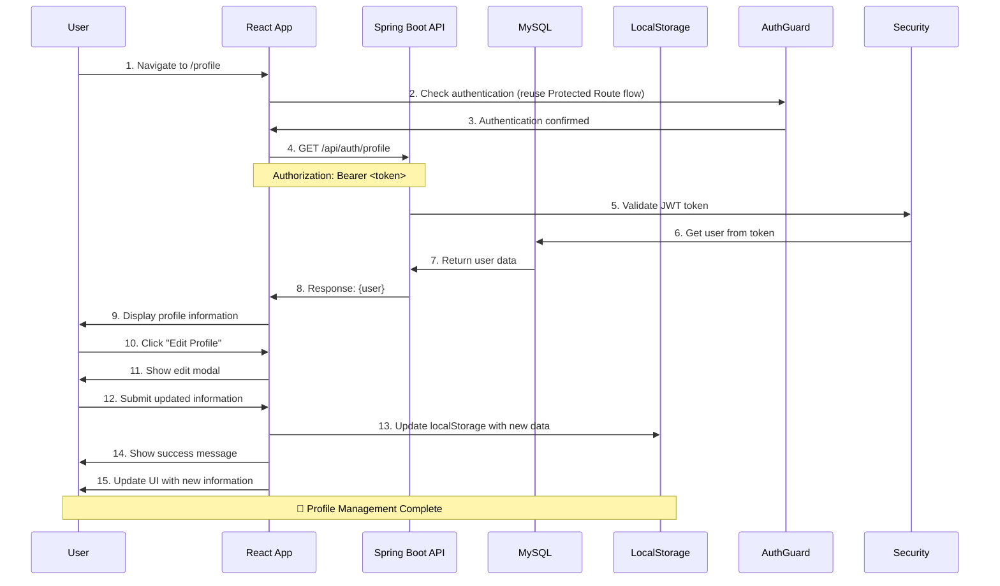
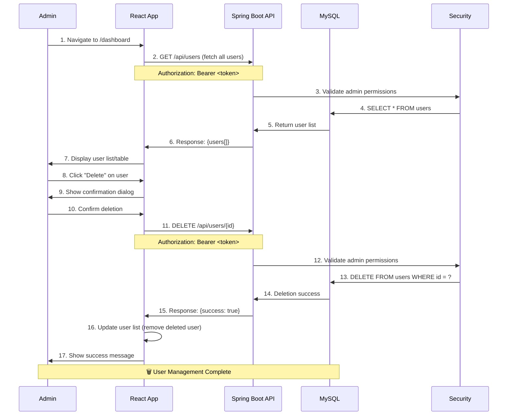
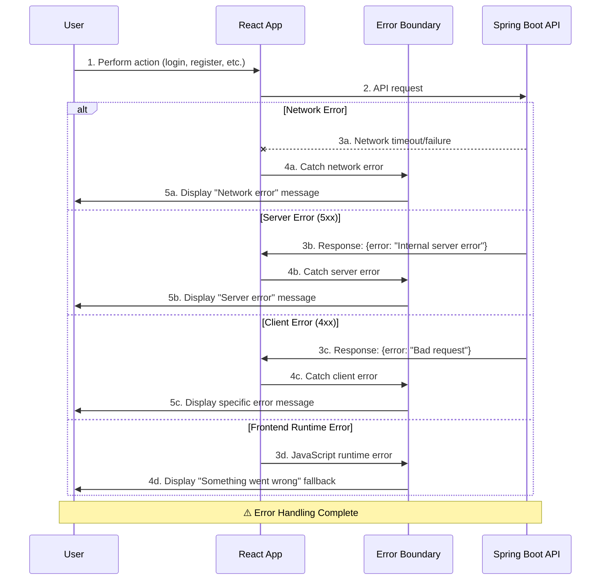
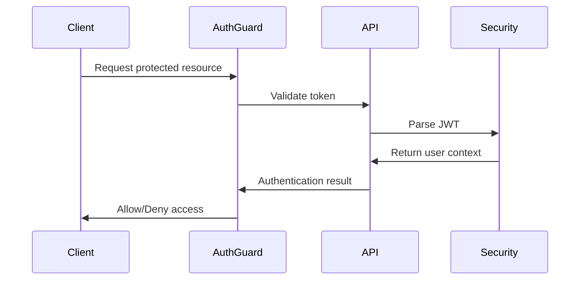
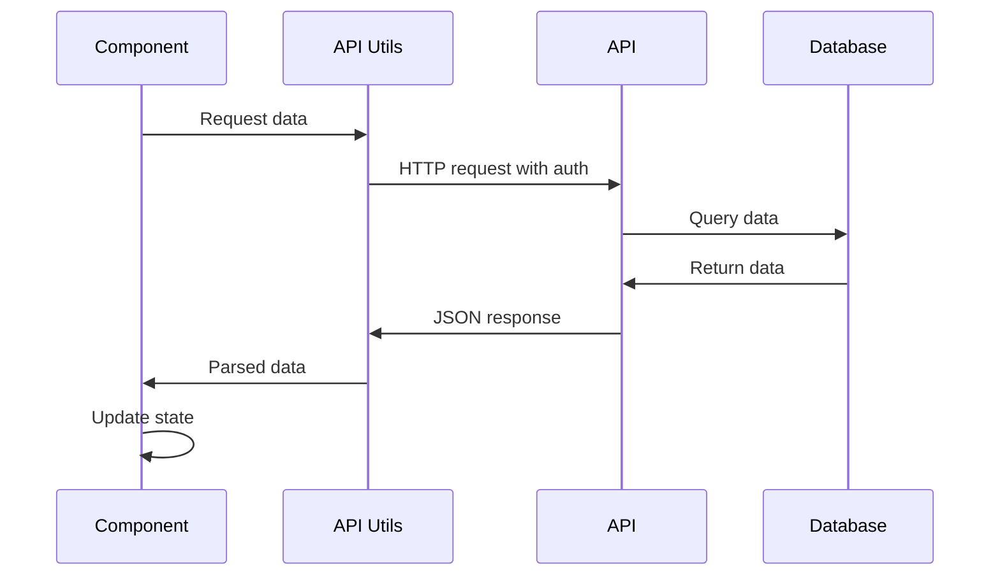

# User Management System - Sequence Diagrams

## 📋 Overview

This document contains sequence diagrams that illustrate the key interactions and workflows within the User Management System. These diagrams are based on the Software Requirements Specification (SRS) and represent the main use cases and system behaviors.

## 🎯 Key Use Cases

### 1. User Registration
### 2. User Authentication (Login)
### 3. User Profile Management
### 4. User Dashboard Access
### 5. User Account Management (CRUD Operations)

---

## 🔄 Sequence Diagrams

### 1. User Registration Sequence

### 2. User Authentication (Login) Sequence

### 3. Protected Route Access Sequence

### 4. User Profile Management Sequence

### 5. User Management (CRUD) Sequence

### 6. Error Handling Sequence

---

## 🎨 Component Interaction Patterns

### Authentication Pattern

### Data Fetching Pattern

---

## 📊 System Flow Summary

### Main User Journeys

1. **New User Journey**: Register → Login → Dashboard → Profile
2. **Returning User Journey**: Login → Dashboard → Profile/Manage Users
3. **Admin Journey**: Login → Dashboard → User Management → CRUD Operations

### Key Interactions

- **Authentication**: JWT-based stateless authentication
- **Authorization**: Role-based access control (user/admin)
- **Data Persistence**: MySQL database with JPA/Hibernate
- **Error Handling**: Comprehensive error boundaries and validation
- **State Management**: Local storage for tokens, React state for UI

---

## 🔍 Technical Notes

### Security Considerations
- All API endpoints (except auth) require valid JWT token
- Passwords are encoded using BCrypt
- CORS configuration for frontend-backend communication
- Input validation on both frontend and backend

### Performance Considerations
- Lazy loading of components
- Efficient database queries with JPA
- Token-based authentication reduces database hits
- Error boundaries prevent app crashes

### Scalability Considerations
- Stateless JWT authentication
- Modular component architecture
- RESTful API design
- Separation of concerns across layers

---

## 📚 Related Documentation

- [Software Requirements Specification (SRS)](SRS_Ruperez.pdf)
- [Architecture Diagrams](ARCHITECTURE_DIAGRAM.md)
- [API Documentation](README.md#-api-endpoints)
- [Setup Guide](README.md#-getting-started)
