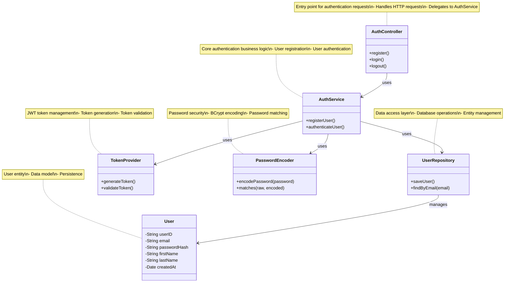
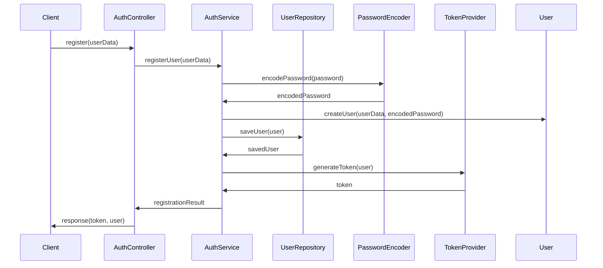
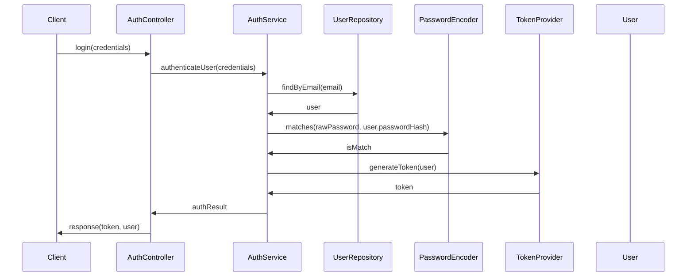

# Authentication System - UML Class Diagram

## 📋 Overview

This document contains the UML class diagram for the authentication system architecture, showing the relationships and interactions between core authentication components.

## 🏗️ UML Class Diagram



---

## 📚 Component Descriptions

### 1. AuthController
**Layer**: Presentation Layer (Controller)
**Purpose**: Entry point for all authentication-related HTTP requests

**Responsibilities**:
- Handle incoming HTTP requests for authentication
- Validate request data
- Delegate business logic to AuthService
- Return appropriate HTTP responses

**Methods**:
- `register()`: Handles user registration requests
- `login()`: Handles user authentication requests
- `logout()`: Handles user logout requests

### 2. AuthService
**Layer**: Business Logic Layer (Service)
**Purpose**: Core authentication business logic and orchestration

**Responsibilities**:
- Implement user registration workflow
- Implement user authentication workflow
- Coordinate between different components
- Handle business rules and validation

**Methods**:
- `registerUser()`: Processes user registration
- `authenticateUser()`: Processes user authentication

**Dependencies**:
- UserRepository: For user data operations
- TokenProvider: For JWT token management
- PasswordEncoder: For password security

### 3. UserRepository
**Layer**: Data Access Layer (Repository)
**Purpose**: Database operations for user entities

**Responsibilities**:
- Abstract database operations
- Provide CRUD operations for users
- Handle data persistence
- Manage entity lifecycle

**Methods**:
- `saveUser()`: Persists user entity to database
- `findByEmail(email)`: Retrieves user by email address

**Dependencies**:
- User: Entity class being managed

### 4. TokenProvider
**Layer**: Security Layer (Utility)
**Purpose**: JWT token generation and validation

**Responsibilities**:
- Generate JWT tokens for authenticated users
- Validate JWT tokens for protected resources
- Handle token expiration and refresh
- Manage token security

**Methods**:
- `generateToken()`: Creates JWT token for user
- `validateToken()`: Validates JWT token authenticity

### 5. PasswordEncoder
**Layer**: Security Layer (Utility)
**Purpose**: Secure password encoding and verification

**Responsibilities**:
- Encode plain text passwords securely
- Verify password matches against stored hash
- Handle password security best practices
- Protect against password attacks

**Methods**:
- `encodePassword(password)`: Encodes plain text password
- `matches(raw, encoded)`: Verifies password against hash

### 6. User
**Layer**: Entity Layer (Model)
**Purpose**: Data model representing user entity

**Attributes**:
- `userID`: Unique user identifier (String)
- `email`: User email address (String)
- `passwordHash`: Encrypted password (String)
- `firstName`: User first name (String)
- `lastName`: User last name (String)
- `createdAt`: Account creation timestamp (Date)

---

## 🔄 Interaction Flow

### Registration Flow


### Login Flow


---

## 🎯 Design Patterns Used

### 1. Repository Pattern
- **Implementation**: UserRepository interface
- **Purpose**: Abstracts data access logic
- **Benefits**: Testability, loose coupling, easier maintenance

### 2. Service Layer Pattern
- **Implementation**: AuthService class
- **Purpose**: Encapsulates business logic
- **Benefits**: Separation of concerns, transaction management

### 3. Dependency Injection
- **Implementation**: Spring Framework DI
- **Purpose**: Loose coupling between components
- **Benefits**: Testability, flexibility, easier maintenance

### 4. Strategy Pattern
- **Implementation**: PasswordEncoder interface
- **Purpose**: Pluggable password encoding strategies
- **Benefits**: Flexibility, security customization

---

## 🔐 Security Considerations

### Password Security
- **Algorithm**: BCrypt (recommended)
- **Strength Factor**: 10-12 rounds
- **Salt**: Automatically generated per password
- **Storage**: Only hash stored, never plain text

### Token Security
- **Algorithm**: HS256 (HMAC-SHA256)
- **Secret**: Secure random key (256-bit minimum)
- **Expiration**: Configurable (typically 24 hours)
- **Claims**: User ID, roles, expiration time

### Data Validation
- **Input Validation**: All user inputs validated
- **SQL Injection Prevention**: Parameterized queries
- **XSS Prevention**: Output encoding
- **CSRF Protection**: Token-based protection

---

## 📊 Technology Stack

### Backend Framework
- **Spring Boot**: Application framework
- **Spring Security**: Security framework
- **Spring Data JPA**: Data access layer
- **Hibernate**: ORM implementation

### Security Libraries
- **JWT (JSON Web Token)**: Token-based authentication
- **BCrypt**: Password encoding
- **Spring Security Crypto**: Security utilities

### Database
- **MySQL**: Relational database
- **H2**: In-memory database (testing)
- **Flyway/Liquibase**: Database migration

---

## 🧪 Testing Strategy

### Unit Tests
- **AuthController**: Test request handling
- **AuthService**: Test business logic
- **UserRepository**: Test data access
- **TokenProvider**: Test token operations
- **PasswordEncoder**: Test password operations

### Integration Tests
- **Authentication Flow**: End-to-end authentication
- **Database Operations**: Repository integration
- **Security Configuration**: Spring Security setup

### Security Tests
- **Authentication Bypass**: Attempt unauthorized access
- **Token Manipulation**: Test token validation
- **Password Attacks**: Test password security

---

## 📚 Related Documentation

- [Software Requirements Specification (SRS)](docs/SRS_Ruperez.pdf)
- [Architecture Diagrams](ARCHITECTURE_DIAGRAM.md)
- [Sequence Diagrams](SEQUENCE_DIAGRAMS.md)
- [ERD Documentation](ERD_Documentation.md)
- [API Documentation](README.md#-api-endpoints)

---

## 🔧 Implementation Notes

### Spring Boot Configuration
```java
@RestController
@RequestMapping("/api/auth")
public class AuthController {
    @Autowired
    private AuthService authService;
    
    @PostMapping("/register")
    public ResponseEntity<?> register(@RequestBody RegisterRequest request) {
        return authService.registerUser(request);
    }
    
    @PostMapping("/login")
    public ResponseEntity<?> login(@RequestBody LoginRequest request) {
        return authService.authenticateUser(request);
    }
}
```

### Service Implementation
```java
@Service
public class AuthService {
    @Autowired
    private UserRepository userRepository;
    
    @Autowired
    private PasswordEncoder passwordEncoder;
    
    @Autowired
    private TokenProvider tokenProvider;
    
    public ResponseEntity<?> registerUser(RegisterRequest request) {
        // Registration logic
    }
    
    public ResponseEntity<?> authenticateUser(LoginRequest request) {
        // Authentication logic
    }
}
```

This UML class diagram provides a comprehensive view of the authentication system architecture, showing the relationships and interactions between all core components.
